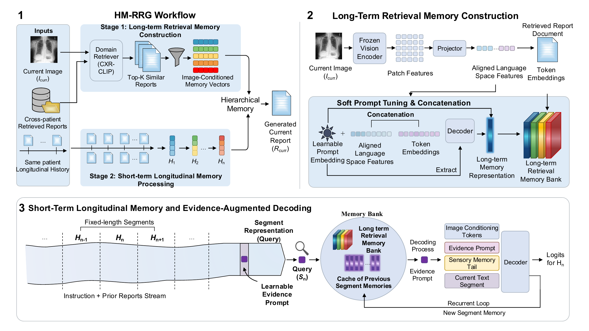

# HM-RRG: Hierarchical Memory for Radiology Report Generation (MICCAI 2026)

This repository contains the code for **HM-RRG: Hierarchical Memory for Radiology Report Generation**.

HM-RRG uses two memory sources when generating a report for a current chest X-ray:

- **Retrieval memory**: reports from visually similar training cases are compressed into image-conditioned memory vectors.
- **Longitudinal memory**: the patient's prior reports are processed chronologically into segment-level memories.

At each text segment, HM-RRG builds a segment query, retrieves from the union of retrieval and longitudinal memories, and decodes with current-image tokens, retrieved memory, local sensory memory, and the current segment.



## Repository Layout

```text
hmrrg/
  data/       Data loading, prior-report construction, retrieval attachment, collators.
  models/     Retrieval memory, recurrent HM-RRG wrapper, image/VLM adapters.
  training/   Shared CLI and training utilities.
scripts/
  build_retrieval_index.py
  train_llm_hmrrg.py
  train_vlm_hmrrg.py
  eval_hmrrg.py
```

## Installation

```bash
conda create -n hmrrg python=3.10 -y
conda activate hmrrg
pip install -r requirements.txt
```

Install the PyTorch build that matches your GPU environment before installing the remaining dependencies if needed.

## Data

The experiments use Longitudinal-MIMIC, a longitudinal chest X-ray report generation setup derived from MIMIC-CXR and MIMIC-CXR-JPG v2.1.0. Images come from MIMIC-CXR-JPG, and reports/study metadata are organized into patient-level chronological histories so that each target study can use earlier same-patient reports as longitudinal context.

MIMIC-CXR-JPG v2.1.0 is available from PhysioNet:

https://physionet.org/content/mimic-cxr-jpg/2.1.0/

Download the dataset through PhysioNet and keep images outside this repository. The scripts expect local image roots, for example:

```text
/path/to/mimic_cxr_jpg_train
/path/to/mimic_cxr_jpg_valtest
```

## Annotation File

Prepare one JSON file with `train`, `val`, and `test` keys:

```json
{
  "train": [
    {
      "id": "sample-id",
      "subject_id": "10000032",
      "study_id": 50414267,
      "study_date": "21800506",
      "image_path": ["files/p10/p10000032/s50414267/example.jpg"],
      "report": "Radiology report text..."
    }
  ],
  "val": [],
  "test": []
}
```

The loader constructs chronological same-patient prior reports from earlier studies in the same split.

## Retrieval File

Retrieved neighbors are supplied as JSONL or JSONL.GZ:

```json
{"id": "sample-id", "neighbors": [["neighbor-id", 0.91], ["neighbor-id-2", 0.87]]}
```

Only training-split reports are used as retrieval text sources.

If you have image embeddings, build cosine nearest-neighbor retrieval with:

```bash
python scripts/build_retrieval_index.py \
  --annotation-json /path/to/annotation_single_view.json \
  --embedding-jsonl /path/to/image_embeddings.jsonl \
  --output-jsonl outputs/retrieval_neighbors.jsonl \
  --top-k 5
```

## Dry Runs

Dry runs validate record loading and HM-RRG memory plumbing without loading large models.

```bash
python scripts/train_llm_hmrrg.py \
  --stage 1 \
  --annotation-json /path/to/annotation_single_view.json \
  --train-image-root /path/to/mimic_cxr_jpg_train \
  --valtest-image-root /path/to/mimic_cxr_jpg_valtest \
  --dry-run
```

```bash
python scripts/train_vlm_hmrrg.py \
  --stage 2 \
  --annotation-json /path/to/annotation_single_view.json \
  --train-image-root /path/to/mimic_cxr_jpg_train \
  --valtest-image-root /path/to/mimic_cxr_jpg_valtest \
  --dry-run
```

## LLM Training

Stage 1 trains the image-conditioned retrieval-memory path:

```bash
python scripts/train_llm_hmrrg.py \
  --stage 1 \
  --annotation-json /path/to/annotation_single_view.json \
  --train-image-root /path/to/mimic_cxr_jpg_train \
  --valtest-image-root /path/to/mimic_cxr_jpg_valtest \
  --retrieval-jsonl outputs/retrieval_neighbors.jsonl \
  --model-name BioMistral/BioMistral-7B \
  --cxrclip-ckpt /path/to/r50_m.tar \
  --output-dir outputs/llm-hmrrg \
  --batch-size 1 \
  --max-steps 2000
```

Stage 2 enables retrieval over both retrieval memory and previous segment memories:

```bash
python scripts/train_llm_hmrrg.py \
  --stage 2 \
  --annotation-json /path/to/annotation_single_view.json \
  --train-image-root /path/to/mimic_cxr_jpg_train \
  --valtest-image-root /path/to/mimic_cxr_jpg_valtest \
  --retrieval-jsonl outputs/retrieval_neighbors.jsonl \
  --model-name BioMistral/BioMistral-7B \
  --cxrclip-ckpt /path/to/r50_m.tar \
  --stage1-checkpoint outputs/llm-hmrrg/stage1.pt \
  --output-dir outputs/llm-hmrrg \
  --batch-size 1 \
  --max-steps 8000
```

Useful options:

- `--use-lora` / `--no-use-lora`
- `--lora-r 16`
- `--lora-alpha 16`
- `--segment-length 128`
- `--bptt-depth 2`
- `--top-k 5`

## VLM Training

The VLM path wraps a Qwen2.5-VL/Lingshu-compatible model and uses its visual encoder to produce current-image tokens.

Stage 1:

```bash
python scripts/train_vlm_hmrrg.py \
  --stage 1 \
  --annotation-json /path/to/annotation_single_view.json \
  --train-image-root /path/to/mimic_cxr_jpg_train \
  --valtest-image-root /path/to/mimic_cxr_jpg_valtest \
  --retrieval-jsonl outputs/retrieval_neighbors.jsonl \
  --model-name lingshu-medical-mllm/Lingshu-7B \
  --output-dir outputs/vlm-hmrrg \
  --batch-size 1 \
  --max-steps 2000
```

Stage 2:

```bash
python scripts/train_vlm_hmrrg.py \
  --stage 2 \
  --annotation-json /path/to/annotation_single_view.json \
  --train-image-root /path/to/mimic_cxr_jpg_train \
  --valtest-image-root /path/to/mimic_cxr_jpg_valtest \
  --retrieval-jsonl outputs/retrieval_neighbors.jsonl \
  --model-name lingshu-medical-mllm/Lingshu-7B \
  --stage1-checkpoint outputs/vlm-hmrrg/stage1.pt \
  --output-dir outputs/vlm-hmrrg \
  --batch-size 1 \
  --max-steps 8000
```

## Evaluation

```bash
python scripts/eval_hmrrg.py \
  --predictions-json outputs/preds.json \
  --references-json outputs/refs.json \
  --output-json outputs/eval.json
```

Both input files should map example ids to report text:

```json
{
  "sample-id": "Report text..."
}
```

## Attribution

The hierarchical-memory implementation is adapted from HMT:

https://github.com/OswaldHe/HMT-pytorch

See `NOTICE` and `LICENSE` for licensing and attribution details. When using MIMIC-CXR-JPG, follow the dataset's PhysioNet citation requirements.
